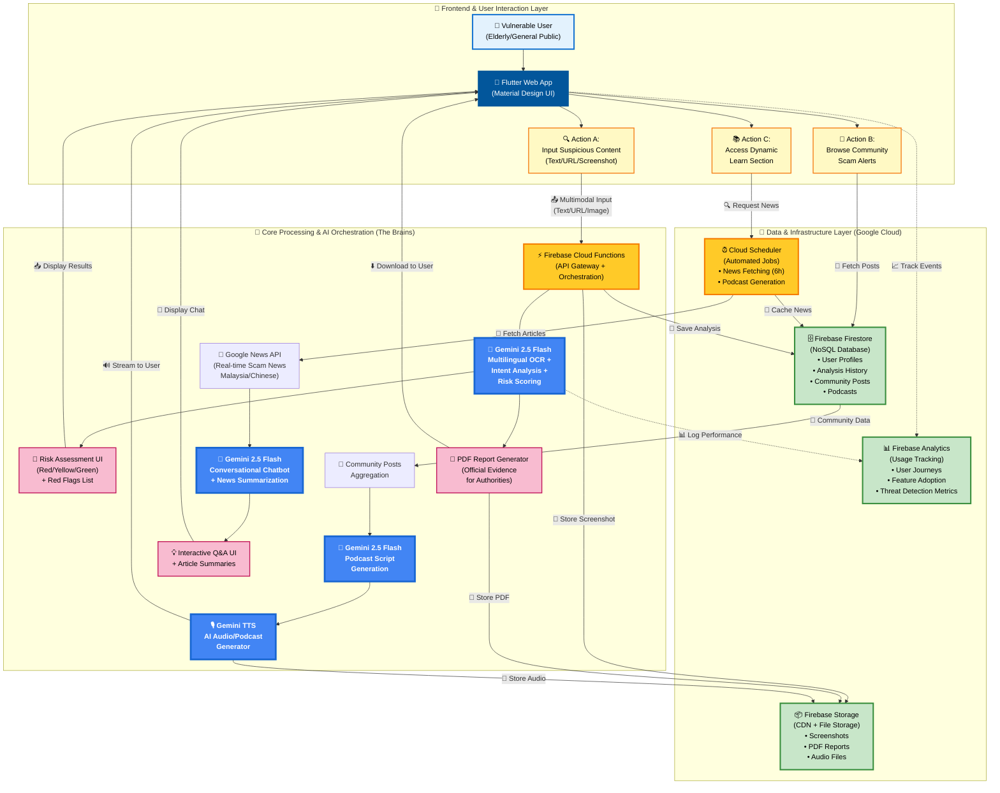
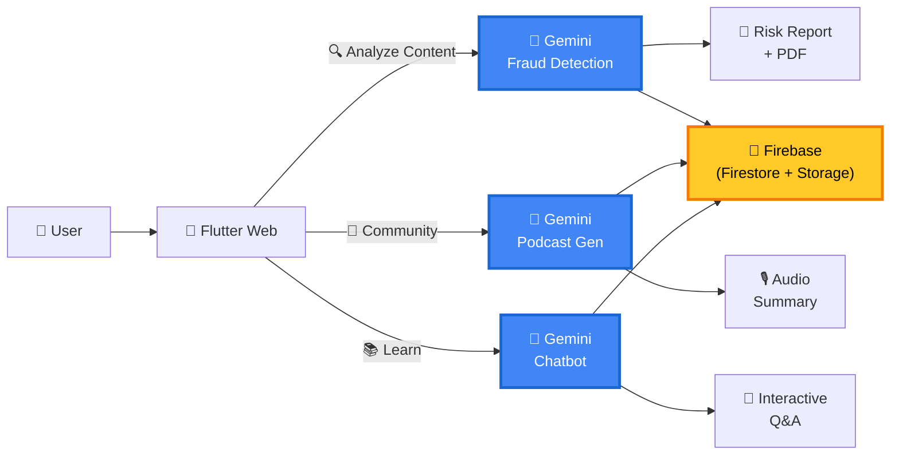
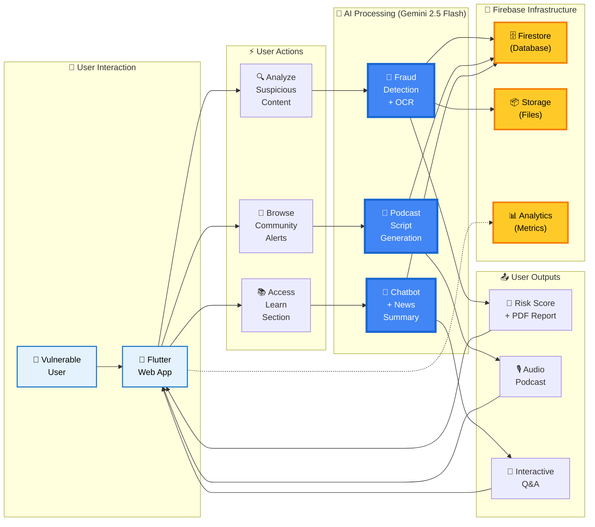
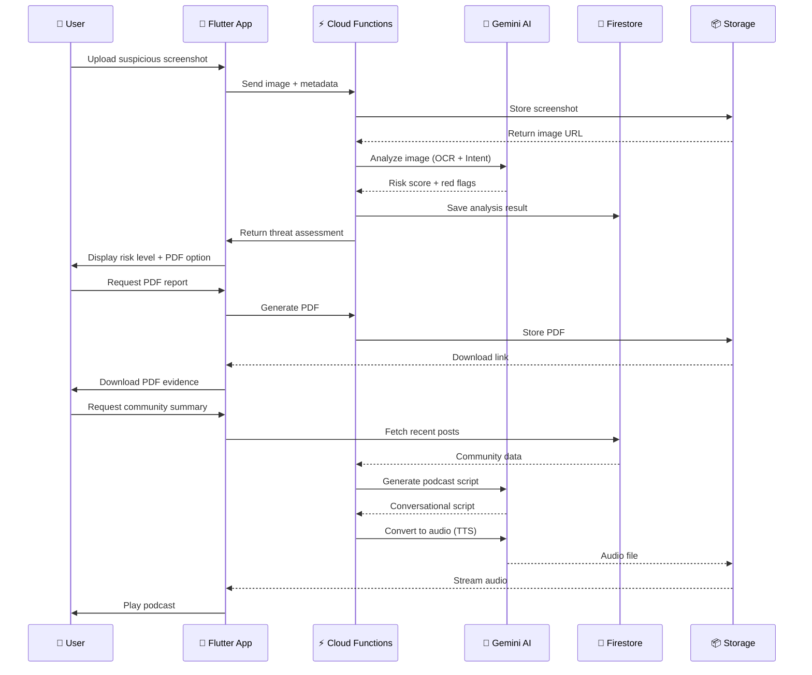
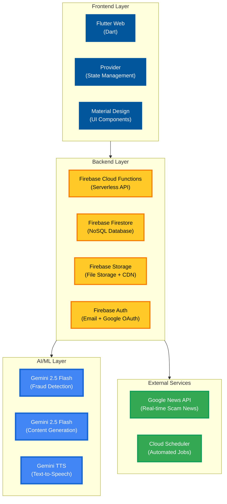

# AskBeforeAct - System Architecture Diagram

## Interactive Mermaid Flowchart

Copy this code into your README.md or use https://mermaid.live to render it:



---

## Simplified Version (For Presentations)

If you need a cleaner, more compact version for slides:



---

## Alternative: Horizontal Flow (Left-to-Right Story)

Perfect for wide presentations or documentation:



---

## Data Flow Sequence Diagram

For showing the exact sequence of operations:



---

## Technology Stack Visualization



---

## How to Use These Diagrams

### 1. **In GitHub README.md**
Simply paste the mermaid code blocks directly into your README:

````markdown
## System Architecture

```mermaid
graph TB
    [paste the mermaid code here]
```
````

### 2. **In Hackathon Submission Documents**
- Copy the code to https://mermaid.live
- Click "Export" → PNG or SVG
- Insert the image into your submission PDF/slides

### 3. **In Presentations**
- Use the "Simplified Version" for overview slides
- Use the "Detailed Version" for technical deep-dives
- Use the "Sequence Diagram" to explain user journeys

### 4. **For Documentation**
- The detailed version works great in technical documentation
- The horizontal flow is perfect for wide-format docs

---

## Customization Tips

**To change colors**, modify the `classDef` lines:
```mermaid
classDef myStyle fill:#YOUR_COLOR,stroke:#BORDER_COLOR,stroke-width:3px
```

**To add more details**, insert new nodes:
```mermaid
NewNode["📌 Your Feature<br/>(Description)"]
```

**To change layout direction**:
- `graph TB` = Top to Bottom
- `graph LR` = Left to Right
- `graph TD` = Top Down (same as TB)

---

## Pro Tips for Hackathon Judges

1. **Use the detailed version** in your technical documentation
2. **Use the simplified version** in your pitch deck
3. **Use the sequence diagram** to explain user flows
4. **Export as SVG** for crisp, scalable images
5. **Add your brand colors** to match your app theme

The diagrams clearly show:
✅ Multi-modal AI capabilities (Gemini handling text, images, audio)
✅ Real-time data processing (Firebase integration)
✅ User-centric design (three distinct user actions)
✅ Scalable architecture (serverless Firebase backend)
✅ Complete data flow (from input to output)

Perfect for demonstrating technical sophistication to judges! 🚀
