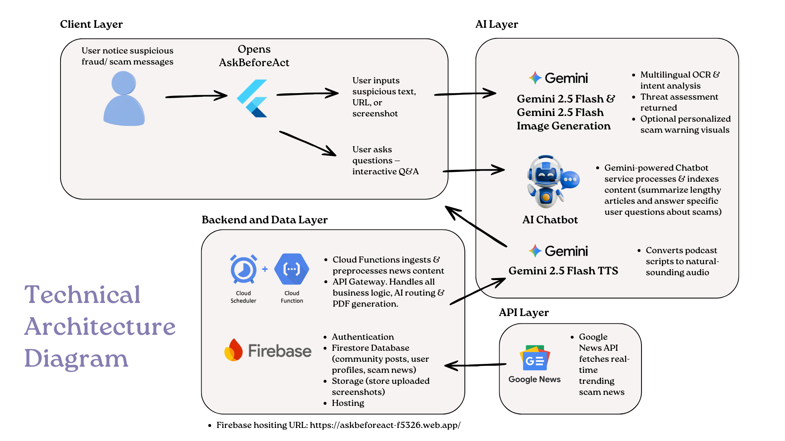
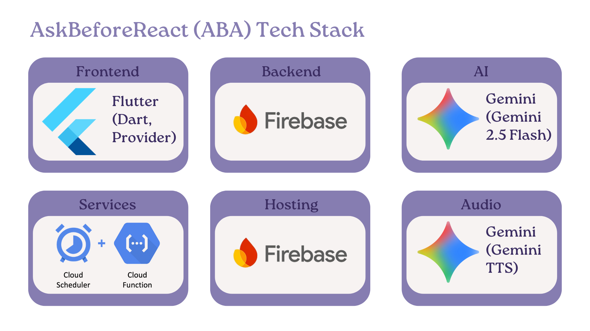

<div align="center">

# 🛡️ AskBeforeAct (ABA)
**AI-Powered Fraud Detection & Digital Literacy Platform**

[](https://github.com/)
[](https://flutter.dev/)
[](https://firebase.google.com/)
[](https://ai.google.dev/)

*Protecting vulnerable populations from digital fraud through real-time AI analysis, accessible community alerts, and dynamic digital literacy.*

</div>

---

## 📖 Overview

AskBeforeAct is an AI-powered web application that helps users detect online fraud by analyzing screenshots, text messages, and URLs. Using Google's Gemini 1.5 Flash AI, it provides instant risk assessment with actionable recommendations.

**Key Features:**
- 🔍 Multi-format fraud detection (screenshots, text, URLs)
- 🤖 AI-powered analysis with risk scoring
- 📊 Analysis history tracking
- 👥 Community platform for sharing experiences
- 📚 Educational resources on common scams
- 📰 Real-time scam news from Google News RSS
- 💬 AI chatbot for Q&A and news summarization
- 🎙️ AI-generated educational podcasts

---

## 🏗️ Technical Architecture

The solution is built on a highly scalable, serverless architecture designed for rapid real-time processing and seamless AI integration, utilizing a **Layered MVVM with Repository Pattern**.



┌─────────────────────────────────────────────────────┐
│                     USER INTERFACE                  │
│                Flutter Web Application              │
└────────────────────┬────────────────────────────────┘
                     │
┌────────────────────▼────────────────────────────────┐
│                   STATE MANAGEMENT                  │
│          Provider (ChangeNotifier Pattern)          │
└────────────────────┬────────────────────────────────┘
                     │
        ┌────────────┼────────────┐
        │            │            │
┌───────▼──────┐ ┌───▼──────┐ ┌───▼─────────┐
│   Analysis   │ │Community │ │ Education   │
│  Repository  │ │Repository│ │ Repository  │
└───────┬──────┘ └───┬──────┘ └───┬─────────┘
        │            │            │
┌───────▼────────────▼────────────▼─────────┐
│                   SERVICES LAYER          │
│  ┌──────────┐  ┌──────────┐  ┌─────────┐  │
│  │  Gemini  │  │Firestore │  │ Podcast │  │
│  │ Service  │  │ Service  │  │ Service │  │
│  └──────────┘  └──────────┘  └─────────┘  │
└───────┬────────────┬────────────┬─────────┘
        │            │            │
┌───────▼────────────▼────────────▼─────────┐
│              GOOGLE CLOUD PLATFORM        │
│  • Gemini 2.5 Flash API                   │
│  • Firebase Firestore                     │
│  • Firebase Storage                       │
│  • Firebase Cloud Functions               │
│  • Firebase Hosting                       │
└───────────────────────────────────────────┘

---

## 🛠️ Implementation Details



| Layer | Technology | Purpose |
|-------|-----------|---------|
| **Frontend** | Flutter Web | Cross-platform UI framework |
| **Backend** | Firebase | Serverless backend (Auth, DB, Storage) |
| **Database** | Cloud Firestore | NoSQL document database |
| **Storage** | Firebase Storage | Image/file hosting |
| **AI** | Gemini 2.5 Flash | Fraud detection & content generation |
| **Cloud Functions** | Firebase Functions | Automated news fetching & processing |
| **Hosting** | Firebase Hosting | Web hosting & deployment |
| **State Management** | Provider | Flutter state management |

**Total Cost:** $0/month (free tiers)

I implemented three primary sequential data flows to maximize user protection and engagement:

1. **Fraud Analysis & Evidence Generation:** Users upload a suspicious screenshot, text, or URL. The payload routes via Cloud Functions to **Gemini 2.5 Flash** for multilingual OCR (English/Chinese/Malay) and intent analysis. The UI instantly displays a Red/Green threat indicator, and generates a downloadable PDF official report via Firebase Storage.
2. **AI Podcast Community Feed:** To reduce reading friction for the elderly, community scam alerts are fetched from Firestore, summarized by Gemini, and converted into an AI Audio Podcast (filterable by today/week/month).
3. **Dynamic Learning & Q&A Chatbot:** Instead of static articles, we use the **Google News API** to fetch real-time trending scams. This feeds into a Gemini-powered Chatbot, providing an interactive Q&A experience on the latest threats.

---

## 🚧 Challenges Faced 

**Challenge 1: The "Silent" AI Podcast (Deep Tech Debugging)**
* **The Problem:** Our Text-to-Speech (TTS) audio for the community feed refused to play in any web browser, throwing a cryptic `DEMUXER_ERROR` and total silence, despite loading the correct track duration.
* **The Debugging & Solution:** After standard MIME-type tweaks failed, a binary inspection revealed the AI API was returning "raw" sound waves (PCM data). Browsers require audio to be packaged in a `.wav` container starting with a specific 44-byte header. Essentially, the AI was sending the letter, but forgot the envelope. To keep the web app lean, I avoided importing heavy third-party transcoding libraries. Instead, I directed my AI coding assistant to rapidly generate the precise Dart hex-code boilerplate. Injecting this 44-byte "RIFF WAVE" header directly into the raw stream instantly transformed the unreadable data into a flawlessly playable WAV file.

**Challenge 2: The Solo Full-Stack Bottleneck (Rapid Learning & Execution)**
* **The Problem:** This is my first full-stack project. Building a comprehensive, multi-layered architecture—spanning a Flutter frontend, Firebase serverless backend, and multiple Google API integrations—as a solo developer within a strict hackathon timeframe was incredibly daunting. It required rapid context-switching and a steep learning curve for specific AI behaviors.
* **The Solution:** I enforced a strict Layered MVVM architecture from day one to prevent spaghetti code, ensuring business logic remained decoupled from the UI. Furthermore, I strategically treated AI (like Cursor and Gemini) not just as feature components, but as my "pair programmers," using them to accelerate boilerplate generation and navigate unfamiliar framework documentation, allowing one person to deliver a production-ready MVP.

---

## 📈 Future Roadmap

### Version 1.1 (Month 2)
- [ ] Comments on community posts
- [ ] PDF report downloads
- [ ] Share analysis results
- [ ] User profile pages

### Version 1.2 (Month 3)
- [ ] Official fraud alerts integration
- [ ] Email notifications
- [ ] Advanced analytics dashboard
- [ ] Export analysis history

### Version 2.0 (Month 4-6)
- [ ] Mobile apps (iOS/Android)
- [ ] Browser extension
- [ ] Premium tier ($4.99/month)
- [ ] API access for developers

---

## 📦 Firebase Services

### 1. Authentication
- Email/Password authentication
- Google OAuth
- Anonymous authentication
- Session management

### 2. Cloud Firestore
Collections:
- `users` - User profiles
- `analyses` - Fraud analysis results
- `communityPosts` - Community shared experiences
- `education_content` - Scam education guides (5 types)
- `scam_news` - Real-time scam news articles (auto-updated)

### 3. Firebase Storage
- Screenshot uploads
- User-specific folders
- 5MB file size limit
- Automatic CDN distribution

### 4. Security Rules
- User data isolation
- Owner-only access for analyses
- Public read for community posts
- Read-only education content

---

## 🚀 Quick Start

### Prerequisites
- Node.js and npm installed
- Dart SDK installed
- Flutter SDK installed
- Firebase account
- Google AI Studio account (for Gemini API)

### Setup Steps

1. **Clone the repository**
   ```bash
   git clone <repository-url>
   cd AskBeforeAct-ABA-
   ```

2. **Follow Firebase setup**
   ```bash
   # See FIREBASE_QUICK_START.md for detailed steps
   npm install -g firebase-tools
   firebase login
   firebase init hosting
   ```

3. **Configure Flutter**
   ```bash
   dart pub global activate flutterfire_cli
   flutterfire configure --project=askbeforeact-f5326
   ```

4. **Deploy security rules**
   ```bash
   firebase deploy --only firestore:rules,storage:rules
   ```

5. **Set up environment variables**
   ```bash
   # Create .env file
   echo GEMINI_API_KEY=your_key_here > .env
   ```

6. **Start development**
   ```bash
   flutter run -d chrome
   ```

For detailed instructions, see **[FIREBASE_QUICK_START.md](FIREBASE_QUICK_START.md)**.

---

## 📊 Database Schema

### Users Collection
```javascript
users/{userId}
  - id: string
  - email: string
  - displayName: string
  - createdAt: timestamp
  - analysisCount: number
  - isAnonymous: boolean
```

### Analyses Collection
```javascript
analyses/{analysisId}
  - userId: string
  - type: "screenshot" | "text" | "url"
  - content: string
  - riskScore: number (0-100)
  - riskLevel: "low" | "medium" | "high"
  - scamType: string
  - redFlags: array<string>
  - recommendations: array<string>
  - confidence: string
  - createdAt: timestamp
```

### Community Posts Collection
```javascript
communityPosts/{postId}
  - userId: string
  - userName: string
  - isAnonymous: boolean
  - scamType: string
  - content: string (max 500 chars)
  - upvotes: number
  - downvotes: number
  - netVotes: number
  - voters: map<userId, "up"|"down">
  - reported: boolean
  - reportCount: number
  - createdAt: timestamp
```

### Education Content Collection
```javascript
education_content/{scamTypeId}
  - id: string
  - title: string
  - description: string
  - warningSigns: array<string>
  - preventionTips: array<string>
  - example: string
  - order: number
```

### Scam News Collection
```javascript
scam_news/{newsId}
  - title: string
  - link: string (URL to article)
  - pubDate: timestamp
  - contentSnippet: string
  - source: string
  - createdAt: timestamp
  - updatedAt: timestamp
```

---

## 📰 Learn Section Features

### Education Content
- **5 Common Scam Types**: Phishing, Romance, Payment, Job, Tech Support
- **Detailed Information**: Warning signs, prevention tips, real examples
- **Interactive UI**: Tap cards to view detailed modal with full information
- **Offline Support**: Fallback data when Firebase is unavailable

### Real-Time Scam News
- **Automated Updates**: Cloud Function fetches news every 6 hours
- **Google News RSS**: Targets Malaysia/Chinese context
- **Search Terms**: Scam OR Fraud OR 诈骗
- **Duplicate Prevention**: Uses URL as document ID
- **Manual Trigger**: HTTP function for immediate updates

### Cloud Functions
1. **`fetchScamNews`** (Scheduled)
   - Runs every 6 hours (12 AM, 6 AM, 12 PM, 6 PM GMT+8)
   - Fetches and parses Google News RSS
   - Stores in Firestore `scam_news` collection
   - Prevents duplicates automatically

2. **`fetchScamNewsManual`** (HTTP)
   - Manual trigger for testing
   - Same functionality as scheduled version
   - Returns JSON response with stats

3. **`initializeEducationContent`** (HTTP)
   - One-time initialization
   - Populates `education_content` collection
   - Creates 5 scam type documents

### Setup Learn Section
```bash
# Quick setup (5 minutes)
cd functions && npm install && cd ..
firebase deploy --only functions
curl https://YOUR_REGION-YOUR_PROJECT_ID.cloudfunctions.net/initializeEducationContent
curl https://YOUR_REGION-YOUR_PROJECT_ID.cloudfunctions.net/fetchScamNewsManual
```

For detailed instructions, see **[LEARN_SECTION_QUICK_START.md](LEARN_SECTION_QUICK_START.md)**.

---

## 🔐 Security

### Authentication
- Firebase Authentication handles all user management
- Secure token-based authentication
- Support for multiple auth providers

### Data Security
- Firestore Security Rules enforce data isolation
- Users can only access their own data
- Storage rules prevent unauthorized file access
- All API keys stored in environment variables

### Best Practices
- Never commit `.env` files
- Keep `firebase_options.dart` private (if public repo)
- Use HTTPS for all connections
- Implement rate limiting for API calls

---

## 💰 Cost Breakdown

### Free Tier Limits
| Service | Free Tier | Estimated Usage | Status |
|---------|-----------|-----------------|--------|
| **Firebase Hosting** | 10GB storage, 360MB/day | ~1GB, 50MB/day | ✅ Free |
| **Firebase Auth** | Unlimited | ~500 users | ✅ Free |
| **Firestore** | 50K reads, 20K writes/day | ~5K reads, 3K writes/day | ✅ Free |
| **Firebase Storage** | 5GB, 1GB/day transfer | ~500MB, 100MB/day | ✅ Free |
| **Cloud Functions** | 2M invocations/month | ~120/month (scheduled) | ✅ Free |
| **Gemini 1.5 Flash** | 15 RPM, 1M tokens/min | ~500 requests/day | ✅ Free |

**Total Monthly Cost:** $0

### Scaling Costs
If you exceed free tiers:
- Gemini API: $0.075 per 1M input tokens
- Firebase Blaze plan: Pay-as-you-go
- Estimated cost at 10K users: $25-50/month

---

## 🧪 Testing

### Manual Testing Checklist
- [ ] User registration and login
- [ ] Screenshot upload and analysis
- [ ] Text analysis
- [ ] URL analysis
- [ ] Analysis history display
- [ ] Community post creation
- [ ] Voting on posts
- [ ] Education content access

### Security Testing
- [ ] Verify users can't access others' data
- [ ] Test file upload size limits
- [ ] Verify authentication requirements
- [ ] Test security rules in Firebase Console

---

## 🤝 Contributing

This is currently a solo project, but contributions are welcome once the MVP is launched.

### Development Workflow
1. Fork the repository
2. Create a feature branch
3. Make your changes
4. Test thoroughly
5. Submit a pull request

---

## 📄 License

[License information to be added]

---

## 📞 Support

- **Documentation:** See the `docs/` folder
- **Issues:** [GitHub Issues](link-to-issues)
- **Email:** [Your email]

---

## 🙏 Acknowledgments

- **Firebase** - Serverless backend platform and web hosting
- **Google Gemini** - AI-powered fraud detection
- **Flutter** - Cross-platform UI framework

---

## 📝 Project Structure

```
AskBeforeAct-ABA-/
├── docs/
│   ├── 01_PRD_MVP.md
│   ├── 03_TECH_STACK.md
│   ├── 05_BACKEND_STRUCTURE.md
│   ├── FIREBASE_SETUP_GUIDE.md
│   ├── FIREBASE_QUICK_START.md
│   ├── FIREBASE_SETUP_SUMMARY.md
│   └── FIREBASE_SETUP_FLOWCHART.md
├── lib/
│   ├── models/
│   ├── services/
│   ├── repositories/
│   ├── screens/
│   ├── widgets/
│   └── main.dart
├── firestore.rules
├── storage.rules
├── firestore.indexes.json
├── firebase.json
├── .firebaserc
├── .env (not committed)
├── .gitignore
└── README.md
```

---

## 📚 Documentation

### Getting Started
- **[FIREBASE_QUICK_START.md](FIREBASE_QUICK_START.md)** - Quick setup checklist (45 min)
- **[FIREBASE_SETUP_GUIDE.md](FIREBASE_SETUP_GUIDE.md)** - Detailed setup instructions
- **[FIREBASE_SETUP_SUMMARY.md](FIREBASE_SETUP_SUMMARY.md)** - Overview and reference
- **[FIREBASE_SETUP_FLOWCHART.md](FIREBASE_SETUP_FLOWCHART.md)** - Visual setup guide

### Learn Section Integration
- **[LEARN_SECTION_QUICK_START.md](LEARN_SECTION_QUICK_START.md)** - 5-minute setup guide
- **[LEARN_SECTION_INTEGRATION.md](LEARN_SECTION_INTEGRATION.md)** - Complete integration guide
- **[LEARN_SECTION_ARCHITECTURE.md](LEARN_SECTION_ARCHITECTURE.md)** - Architecture diagrams
- **[LEARN_SECTION_SUMMARY.md](LEARN_SECTION_SUMMARY.md)** - Feature summary
- **[LEARN_SECTION_CHECKLIST.md](LEARN_SECTION_CHECKLIST.md)** - Deployment checklist
- **[functions/README.md](functions/README.md)** - Cloud Functions documentation

### AI Chatbot
- **[CHATBOT_FEATURE.md](CHATBOT_FEATURE.md)** - Complete chatbot guide
- **[CHATBOT_QUICK_REFERENCE.md](CHATBOT_QUICK_REFERENCE.md)** - Quick reference
- **[CHATBOT_IMPLEMENTATION_SUMMARY.md](CHATBOT_IMPLEMENTATION_SUMMARY.md)** - Implementation details

### Architecture & Design
- **[01_PRD_MVP.md](01_PRD_MVP.md)** - Product requirements (MVP scope)
- **[03_TECH_STACK.md](03_TECH_STACK.md)** - Technology stack details
- **[05_BACKEND_STRUCTURE.md](05_BACKEND_STRUCTURE.md)** - Backend architecture & code

### Configuration Files
- **[firestore.rules](firestore.rules)** - Firestore security rules
- **[storage.rules](storage.rules)** - Storage security rules
- **[firestore.indexes.json](firestore.indexes.json)** - Database indexes
- **[firebase.json](firebase.json)** - Firebase configuration

---

## 🎯 Success Metrics

### Week 1 Post-Launch
- 50+ registered users
- 200+ analyses performed
- 10+ community posts
- <5 second average analysis time

### Month 1 Post-Launch
- 500+ registered users
- 2,000+ analyses performed
- 50+ community posts
- 85%+ user satisfaction

---

**Project Status:** 🚀 MVP Deployed & Tested
**Last Updated:** February 13, 2026  
**Version:** 1.0.0-alpha

---

Made with ❤️ to help people stay safe online
